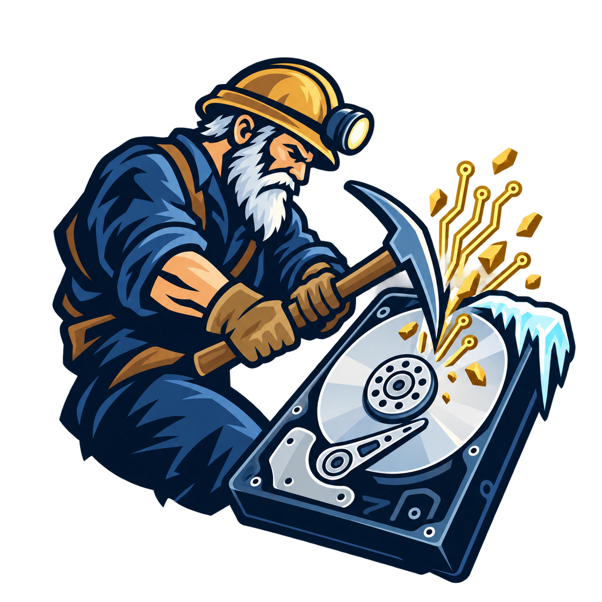

<div align="center">
  
  <h1>Cold Digger</h1>
  <p>Disk-image forensics for crypto wallets, deleted files, browser history, and media.</p>

  [](https://github.com/farrantch/cold-digger/actions/workflows/tests.yaml)
  [](https://github.com/farrantch/cold-digger/releases/latest)
  [](LICENSE)
  
</div>

Cold Digger scans raw disk images locally and leaves the source untouched. It
finds wallet material, recovers deleted files, and builds a searchable offline
report.

## What you get

- Prioritized crypto leads with validation and public-address derivation
- Filesystem recovery with Sleuth Kit and whole-image carving with PhotoRec
- Searchable offline HTML reports, a file browser, and a media gallery
- Resumable scans with evidence provenance and coverage reporting

## Quick start

Ubuntu 24.04 and Python 3.11–3.13 are supported.

```bash
sudo apt update
sudo apt install python3 python3-venv python3-pil python3-libmsiecf \
  python3-libesedb sleuthkit testdisk e2fsprogs poppler-utils \
  tesseract-ocr ffmpeg

python3 -m venv --system-site-packages .venv
source .venv/bin/activate
python -m pip install -e .

cold-digger doctor
cold-digger scan /mnt/images/old-pc.img --output /mnt/recovery/old-pc
```

Open `/mnt/recovery/old-pc/report.html` when the scan finishes.

## Useful commands

```bash
# Continue an interrupted scan
cold-digger scan IMAGE --output CASE --resume

# Browse a case and open individual files from the image
cold-digger serve CASE --image IMAGE

# Rebuild reports without rescanning
cold-digger report CASE

# Check saved progress
cold-digger status CASE
```

## Before you dig

- Input support is currently limited to single-file raw images such as `.img`,
  `.dd`, and `.raw`.
- Use Cold Digger only on media you own or are authorized to examine.
- Cases can contain private keys, seed phrases, personal files, and unredacted
  media. Keep them private.
- A wallet hit or reported balance does not prove ownership or permission to
  access funds.

## Documentation

- [Detailed usage and behavior](docs/reference.md)
- [Architecture and current boundaries](docs/architecture.md)
- [Contributing](CONTRIBUTING.md)
- [Security policy](SECURITY.md)
- [Third-party notices](THIRD_PARTY_NOTICES.md)
