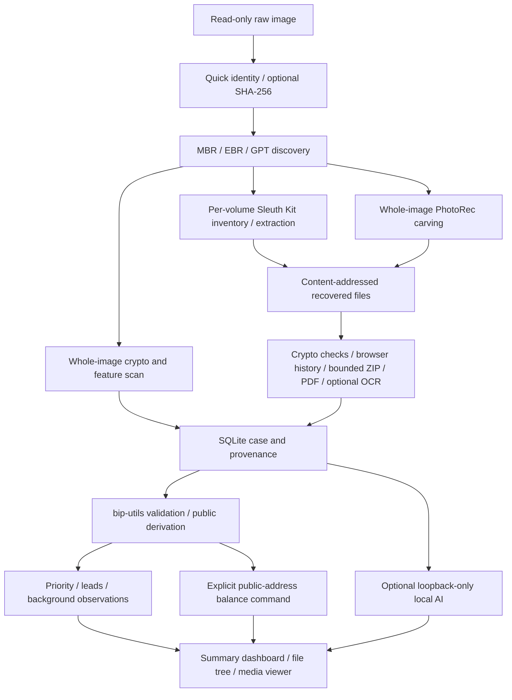

# Architecture

The unit of work is one immutable raw image and one private case directory. The source is read through ordinary file handles and forensic tools; no filesystem is mounted. A case-level advisory lock prevents concurrent writers.

## Data and provenance

`volumes` records byte ranges, signatures and filesystem coverage. `files` records filesystem identifiers, original paths, allocation/deletion observations, timestamps, export state and artifact hashes. `findings` groups matching content by detector type and SHA-256 fingerprint; `occurrences` preserves each source location.

`finding_material` retains supported candidate values privately for later validation. `crypto_assessments` caches parser/derivation results, backend revisions and context flags; it contains public derivations, never seed/private scalar values. Legacy raw candidates can be recovered with bounded source reads and fingerprint comparison. `balances` contains explicitly requested public-address lookup snapshots with provider/time/scope or a failure state. Reporting does not trigger network access. Standard public-key derivation uses `bip-utils` and its secp256k1 backend; no custom elliptic-curve implementation is used.

`triage.py` separates broad observations from wallet/key leads. Generic filename matches stay available under supporting evidence. Example, help-index and code-constant context can demote checksum-valid material. Overlapping seed matches remain unconfirmed. Valid structures and encrypted wallet schemas are distinct from verified key linkage or funds. The dashboard links to all original evidence and highlights any positive provider-reported balance with its scope.

The file explorer has a directory manifest plus inventory chunks of 2,000 rows, loaded on demand through local scripts so it works with `file://` without a server. Only the current result page is rendered. Recovered paths are display data, never OS traversal instructions. Allocation states remain separate, including reallocated and unknown/carved content. The media viewer uses generated artifact URLs, browser-native decoding, pagination and keyboard navigation. HTML text is escaped, script JSON escapes HTML delimiters, and JavaScript uses text nodes for recovered strings. The CSP permits only local assets and forbids remote connections; it does not execute recovered file content as scripts.

The gallery has a separate `media-folders.js` manifest containing only media folders and their ancestors, reusing the file explorer's stable folder IDs and volume boundaries. It supports an expandable tree, breadcrumbs, direct-child folder cards and explicit direct/descendant scope. Folder search retains ancestors, large sibling lists are bounded, and a selected folder beyond the initial sibling limit stays visible. Counts reflect matching media including descendants; duplicate grouping changes the displayed media groups without merging their source folders. Navigation state is saved in the URL and browser history.

The local gallery falls back to an on-demand H.264/AAC MP4 copy when native video decoding fails. Explicit POST requests enqueue a single-worker FFmpeg conversion; polling reports queued/converting/ready/error and a separate byte-range endpoint serves completed copies. Conversions pin their input export/cache for their full queued/running lifetime, coalesce repeated requests, and reserve space from the same byte budget as image reads. A child worker enforces the output file-size limit without `preexec_fn` in the threaded server. Timeouts, low free space and shutdown stop conversion; failed outputs are deleted. Only completed copies become playable. Sources, downloads, scan stages and recovery statuses stay independent of the viewing copy. Inputs use a local protocol/format allowlist excluding playlists; conversion is unavailable from a standalone HTML report.

Raw findings have absolute image offsets. Filesystem findings have volume + inode/record identifier + file offset; physical extents are not fabricated. PhotoRec reports are parsed for validated byte extents where available. PDF/OCR/XML transformations explicitly use offsets in derived text, not offsets in the original disk. File timestamps and camera EXIF dates are observations, not trusted activity/deletion times.

The internal SQLite database and private files retain original paths and secret material. General reports apply masking to recognizable secrets. Gallery images are deliberately separate and unredacted. Tool output is untrusted text and never interpolated into shell commands. HTML is escaped and CSV formula prefixes are neutralized.

`browser_history` stores individual visits, URL-level summaries or explicitly labeled cache references from Chromium/Firefox SQLite and IE index.dat/WebCache; `browser_sources` records parser revisions, export hashes, reader versions, WAL associations and coverage. Row identities combine source file ID, table and database record ID. Reprocessing replaces that source's records transactionally and rebuilds crypto-domain leads, preserving duplicate database copies as separate evidence sources.

SQLite parsing copies the database and any unambiguous matching allocated WAL into a disposable private directory. SQLite opens the copy read-only, with trusted schema disabled, a restricted authorizer, query limits and a progress deadline. It does not load extensions or query recovered views. The source artifact is not modified. Structured records carry table/record IDs, original paths, volume IDs, allocation state of the database, raw timestamps and clock epochs. SQL record IDs are not presented as disk byte offsets. URL queries/userinfo/fragments are omitted in reports; original URLs stay in private case files. Crypto-domain leads feed the existing local-AI evidence interface.

Internet Explorer uses libyal's `pymsiecf` (index.dat) and `pyesedb` (WebCache) through `ie_worker.py`. Native readers open artifacts read-only in a separate, bounded process. JSONL output remains private and carries the original location strings; normalized report URLs remove IE username/date prefixes. index.dat evidence includes native record offsets and recovered-item status. WebCache provenance includes container names/IDs, table enumeration index and entry ID, without claiming physical offsets. Containers are selected by the `Containers` catalog's names, never hardcoded numeric IDs. Only History/MSHist WebCache rows become history summaries. index.dat cache references carry no visit time. Weekly index.dat local times retain their raw FILETIME without guessing the original timezone. FILETIME UTC formatting preserves all seven fractional digits.

Native parser failures, resource limits, record decoding errors and non-clean ESE header state produce partial coverage. ESE logs/checkpoints are retained when found but are not replayed. Reader versions participate in browser-source revision keys; a previously unavailable reader is retried after installation. Header signatures allow exported/carved databases with lost names to be inspected. This does not add a new raw disk carver for IE formats: obtaining an intact file still depends on filesystem export or PhotoRec support.

## Checkpoints and consistency

Raw hits and their chunk checkpoint are committed together. An 8 KiB overlap on both sides of each scan chunk preserves supported candidates crossing chunk boundaries. Replaying a chunk is idempotent because occurrence IDs include detector identity and provenance.

Source checking defaults to `quick`: size, nanosecond modification/change timestamps, inode and device. Older cases saved only size/mtime, so only available fields are compared during their first quick resume. Quick checking does not read image content and is not a cryptographic integrity guarantee. File replacement or remounting can also cause a metadata mismatch. The complete stat identity is compared again after scanning.

`--hash-mode full` computes SHA-256 before every new/resumed scan and verifies any saved digest. If a quick-mode case has no saved digest yet, its metadata must match before establishing a new hash; this does not verify historical quick-mode results retrospectively. A matching saved full digest allows relocation despite metadata changes. Quick resumes can retain a previously computed hash, explicitly labeled historical rather than freshly verified in the report. The chosen mode persists in case configuration; old cases without that setting use the quick default. Artifact content hashes and finding fingerprints are independent of this setting.

Initial identity metadata and configuration are persisted before optional full hashing, so interrupted hashes can resume or switch to quick mode. Empty case shells left by older versions interrupted before saving their first identity can restart initialization. Cases with analysis data but no identity are rejected. The app does not perform a second full post-scan hash. A Docker read-only mount enforces this application's access mode, but cannot stop another host process changing the same source. Use a source you trust to remain unchanged for consistent results.

Filesystem recovery is checkpointed per record; failed/limited exports can be retried with increased limits. Volume inventory and carving have coarser checkpoints. PhotoRec is restarted after interruption, rather than relying on undocumented session-file recovery. Reports can always be regenerated from case data without the source image.

File inventories have no default record-count limit, including on resume of older capped cases. An explicit `--max-files` applies to one invocation only. Export byte budgets remain separate. Pending recovery uses keyset pagination instead of loading all pending records into memory. Mandatory dependency checks precede source hashing, raw scanning and restart archiving; partial tool coverage requires explicit `--allow-partial` on each invocation.

`scan --restart` archives the previous case before creating a new one at the same output path. The CLI validates the source and new settings, acquires the existing case lock, and moves all top-level case entries except `.lock` into a uniquely named private sibling directory. Keeping the output directory and lock inode in place prevents competing CLI processes from writing during the transition or new scan. Each move is a rename, and move failures/interruption attempt rollback; a process killed without cleanup can require restoring entries from the backup manually. Restart does not inherit old settings or checkpoints, and never deletes the archived case. It cannot be combined with resume.

## Local analysis

The AI adapter is an explicit CLI operation, never part of automatic disk scanning. It accepts no tool calls and cannot execute retrieved instructions. It sends only redacted finding metadata, records model identity, rejects nonexistent evidence citations and labels results as AI suggestions. The model runtime must independently have cloud features disabled. No real model is bundled.

## Current boundaries

- Raw single-file images only. E01, split images, VHD/VMDK and live devices are not supported input formats yet.
- GPT primary/backup and MBR/EBR discovery; no automatic lost-partition reconstruction or filesystem repair. Unknown layouts still receive a raw scan and whole-image filesystem probe.
- Encrypted/LVM/APFS containers are identified where signatures are recognizable and marked as requiring additional support. No unlocking, RAID assembly, LVM traversal or snapshot recovery.
- Filesystem parsing/recovery coverage follows the installed Sleuth Kit version. Deleted directory recursion and overwritten records have unavoidable gaps.
- Textual key detection is not a universal binary-key carver. Current seed validation covers English BIP39 only.
- JSON wallet recognition establishes schema similarity, not wallet integrity or decryption.
- PhotoRec carving cannot generally reconstruct arbitrary fragmented files; file exports may contain overwritten content despite matching a recorded size.
- Partial ZIP/PDF/OCR enrichment; no TAR/7z recursion, browser LevelDB/vault parsing, QR decoder or comprehensive email parsing yet. Browser-supported videos play inline; the local server can convert supported legacy codecs into bounded MP4 viewing copies. Damaged/unsupported videos and clips exceeding conversion limits remain download-only. Browser history supports Chromium/Firefox SQL + matched WAL snapshots and IE index.dat/WebCache. No Safari, separate EdgeHTML store, deleted SQLite-cell/ESE-page carving or ESE log replay.
- Public derivation is finite and documented per candidate. BIP39 uses an empty passphrase, account 0, Bitcoin BIP44/49/84/86 and Ethereum BIP44. Relative extended-key paths do not establish the original account path. Password guessing/decryption is not implemented. Balance adapters cover Bitcoin mainnet and Ethereum native ETH; token holdings and other chains are not enumerated.
- SHA-256 duplicate grouping is implemented; semantic similarity, cross-case search and a trusted chronological event model are not.
- Limits bound individual exports and some expansion work, but not the total case database or number of raw findings. Large/noisy images can produce large indexes. Use a dedicated output filesystem and start with a representative image.

## Next extensions

1. Add test fixtures for NTFS/exFAT and additional real-world wallet formats; include known corrupt/fragmented examples.
2. Decode wallet databases and additional browser storage (vaults, downloads, bookmarks) using format-specific, read-only parsers.
3. Add QR decoding, video metadata/previews and broader document/archive extraction with global resource accounting.
4. Build local full-text/semantic retrieval over extracted evidence for document-aware AI analysis.
5. Add queues for multiple images, richer timelines and cross-case duplicate links.

## Primary references

- [Sleuth Kit tools](https://www.sleuthkit.org/sleuthkit/man/)
- [PhotoRec scripted operation](https://www.cgsecurity.org/testdisk_doc/scripted_run.html)
- [BIP39](https://github.com/bitcoin/bips/blob/master/bip-0039.mediawiki)
- [bip-utils](https://github.com/ebellocchia/bip_utils)
- [BIP32](https://github.com/bitcoin/bips/blob/master/bip-0032.mediawiki)
- [EIP-55](https://eips.ethereum.org/EIPS/eip-55)
- [Esplora public-address API](https://github.com/Blockstream/esplora/blob/master/API.md)
- [Ethereum JSON-RPC](https://ethereum.org/en/developers/docs/apis/json-rpc/)
- [Ollama local-only configuration](https://docs.ollama.com/faq)
- [Ollama chat API](https://docs.ollama.com/api/chat)
- [Chromium visits schema](https://github.com/chromium/chromium/blob/main/components/history/core/browser/visit_database.cc)
- [Chromium URL schema](https://github.com/chromium/chromium/blob/main/components/history/core/browser/url_database.cc)
- [Firefox Places tables](https://github.com/mozilla/gecko-dev/blob/master/toolkit/components/places/nsPlacesTables.h)
- [SQLite write-ahead logging and read-only access](https://www.sqlite.org/wal.html)
- [libmsiecf format specification and timestamp meanings](https://github.com/libyal/libmsiecf/blob/main/documentation/MSIE%20Cache%20File%20%28index.dat%29%20format.asciidoc)
- [libesedb format specification](https://github.com/libyal/libesedb/blob/main/documentation/Extensible%20Storage%20Engine%20%28ESE%29%20Database%20File%20%28EDB%29%20format.asciidoc)
- [Plaso WebCache schema interpretation](https://github.com/log2timeline/plaso/blob/main/plaso/parsers/esedb_plugins/msie_webcache.py)
- [Plaso index.dat interpretation](https://github.com/log2timeline/plaso/blob/main/plaso/parsers/msiecf.py)
